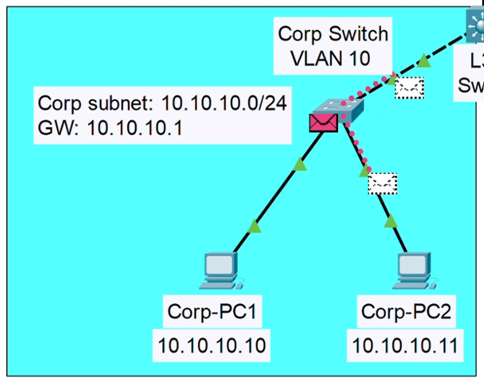
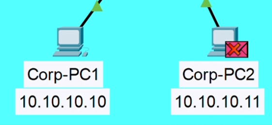
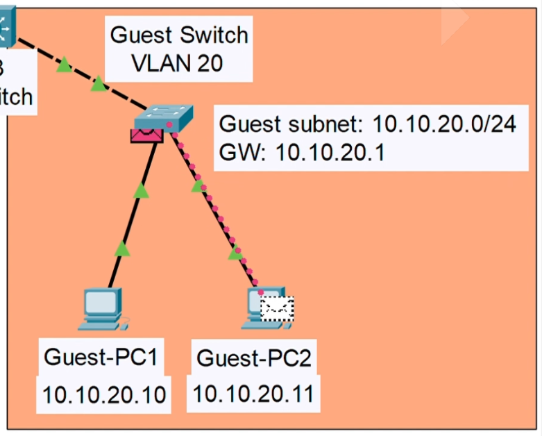

# Part 2 - MAC Learning: Why the Switch Behaved Differently

This is Part 2 of the IBN Guest Isolation lab series.

[← Back to Part 1: IBN Guest Isolation](../README.md)

---

## The Puzzle

In Part 1, Corp-PC1 pinged Guest-PC2. Something interesting happened in the simulation.

The Corp switch flooded the packet to two ports. The Guest switch sent it to exactly one device.



Same network. Same ping. Two completely different forwarding behaviors.

This lab explains why.

---

## The Answer: MAC Learning

A switch doesn't know where anyone lives when it boots up. It learns by listening.

Every frame that arrives teaches it something:
- Source MAC address
- Which port it came from

It writes that down. That's its CAM table. Its map.

**No entry for the destination?** It does the only thing it can —> sends the frame out every port and waits to see who answers. That's flooding. Not a bug. Just a switch working with incomplete information.

The moment the destination replies, the switch learns that MAC too. Next time, it delivers directly. No flooding needed.

---

## Why Corp Switch Flooded

Corp switch had never seen Guest-PC1's MAC address. Guest-PC1 lives on a different subnet —> it had never sent any L2 traffic through the Corp switch before.

So when the routed packet arrived destined for Guest-PC1, Corp switch didn't know which port to use. It flooded to all ports in VLAN 10.

Corp-PC2 got a copy. Checked the destination IP. Realized it wasn't for it. Dropped it silently.



---

## Why Guest Switch Didn't

By the time the packet reached the Guest switch, Guest-PC1 had already sent traffic earlier in the session —> specifically when Guest-PC1 pinged the internet (8.8.8.8).



That outbound traffic taught the Guest switch exactly which port Guest-PC1 was on. MAC learned. Table entry written.

So when the incoming packet arrived, Guest switch looked up the destination MAC, found the entry, and sent it directly. No flooding needed.

**Same network. Different table state. Completely different behavior.**

---

## One More Thing: Aging Time

MAC table entries aren't permanent. A switch forgets them after a period of inactivity.

Default aging time on Cisco switches: **300 seconds (5 minutes).**

Check it with:
```
Switch# show mac address-table aging-time
```

The learning never really stops.

---

The ACL enforced the policy. But MAC learning explained the forwarding asymmetry. Two different mechanisms. One simulation.

