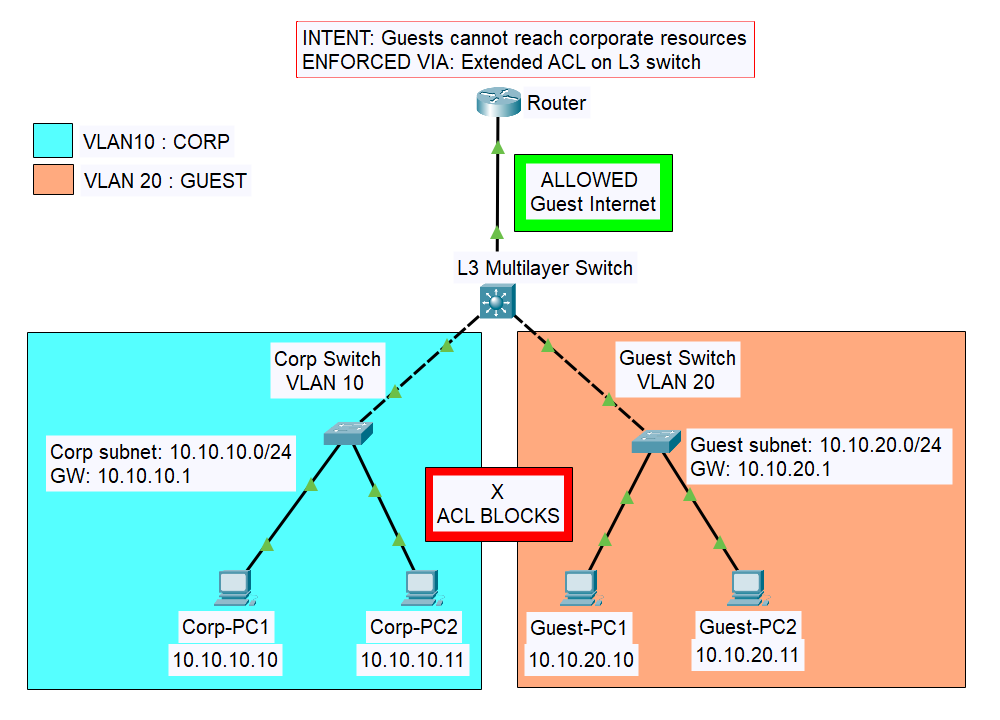
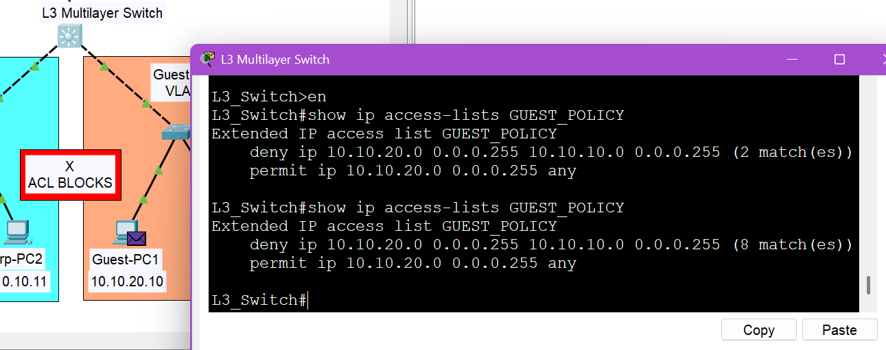
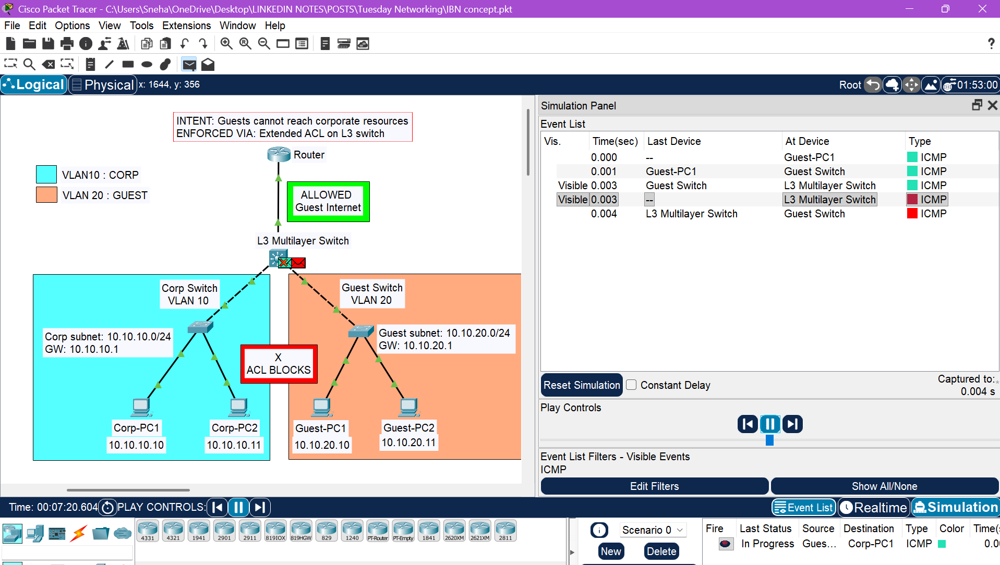

# IBN-Guest_Isolation-PacketTracer
Packet Tracer lab simulating Intent-Based Networking: Guest network isolated from Corporate using VLANs, inter-VLAN routing, and an extended ACL on a Cisco Layer 3 switch.

**Intent**: Guests cannot reach corporate resources. Guests can still access the internet.

This lab simulates the outcome of Intent-Based Networking (IBN) — manually implementing what platforms like Cisco DNA Center would automate. The intent is declared first. Every config decision follows from it.

Built in Cisco Packet Tracer using VLANs, inter-VLAN routing, and an extended ACL on a Layer 3 switch.

**Topology**

```
Two zones, one L3 switch enforcing the boundary:
•	Corporate zone —> VLAN 10, subnet 10.10.10.0/24
•	Guest zone     —> VLAN 20, subnet 10.10.20.0/24
•	L3 switch      —> SVIs for both VLANs, ACL applied inbound on VLAN 20
•	Router         —> simulates internet uplink via loopback (8.8.8.8)
```
**IP Plan**
```
____________________________________________________________
Device        IP Address      Subnet Mask      Gateway  
------------------------------------------------------------
Corp-PC1      10.10.10.10    255.255.255.0    10.10.10.1
Corp-PC2      10.10.10.11    255.255.255.0    10.10.10.1
Guest-PC1     10.10.20.10    255.255.255.0    10.10.20.1
Guest-PC2     10.10.20.11    255.255.255.0    10.10.20.1
VLAN 10 SVI   10.10.10.12    255.255.255.0         —
VLAN 20 SVI   10.10.20.1     255.255.255.0         —
Router Gig0/0 192.168.1.1    255.255.255.252       —
L3Switch UpL  192.168.1.     2255.255.255.252      —
Internet      8.8.8.8        255.255.255.255       —
____________________________________________________________
```
**Key Configuration**
```
VLANs on L3 Switch
-------------------
vlan 10
 name CORPORATE
vlan 20
 name GUEST

SVI Gateways
-------------------
ip routing

interface vlan 10
 ip address 10.10.10.1 255.255.255.0
 no shutdown

interface vlan 20
 ip address 10.10.20.1 255.255.255.0
 no shutdown

ACL — Guest Policy
--------------------------------------
ip access-list extended GUEST_POLICY
 remark Block guest-to-corporate traffic
 deny ip 10.10.20.0 0.0.0.255 10.10.10.0 0.0.0.255
 remark Permit everything else (internet)
 permit ip 10.10.20.0 0.0.0.255 any

Applied Inbound on VLAN 20
--------------------------------------
interface vlan 20
 ip access-group GUEST_POLICY in
```
**Verification**
```
show ip access-lists GUEST_POLICY
```


Expected output:
--------------------------------------
Extended IP access list GUEST_POLICY
    deny ip 10.10.20.0 0.0.0.255 10.10.10.0 0.0.0.255 (8 matches)
    permit ip 10.10.20.0 0.0.0.255 any

The **matches** counter confirms the policy is actively enforcing.

**Test Results**
```
      PING             From            To                     Expected        Result
----------------------------------------------------------------------------------------
Guest → Corporate    Guest-PC1    Corp-PC1 (10.10.10.10)      BLOCKED           ✓
Guest → Same VLAN    Guest-PC1    Guest-PC2 (10.10.20.11)     ALLOWED           ✓
Guest → Internet     Guest-PC1    8.8.8.8                     ALLOWED           ✓
Corp  → Guest        Corp-PC1     Guest-PC1 (10.10.20.10)     ALLOWED           ✓
```


**Debugging Note**
```
-> Cross-VLAN routing failed during the build despite correct SVI and ACL configuration. 
-> Root cause: a trunk port on the Corp switch had silently flipped to access mode.
-> "show interfaces trunk" returned no output for that port — not an error, just a missing line. That absence was the clue. A port not listed as trunking is the problem, not a logged fault.
```
**Fix:**
-------------------------------------
interface fa0/1
 switchport mode trunk
 switchport trunk allowed vlan 10,20


**Concepts Covered**
```
•	VLAN segmentation and trunk configuration (802.1Q)
•	Inter-VLAN routing via SVI on a Cisco Catalyst 3650
•	Extended named ACLs: source/destination filtering, wildcard masks
•	Inbound vs outbound ACL placement
•	Layer 2 flooding vs Layer 3 routed delivery
•	Point-to-point /30 subnetting for router uplinks
•	Intent-Based Networking principles: manual implementation
```


**Tools & Devices**
```
•	Cisco Packet Tracer 8.x
•	Cisco Catalyst 3650 (L3 switch)
•	Cisco Catalyst 2960 (access switches)
•	Cisco 2911 Router
```
